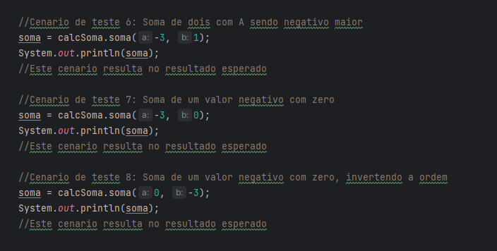

# Calculadora_Teste

## Descrição
  
 Este é um projeto de calculadora, capazde realizar operações de soma, subtração, divisão e multiplicação fazendo uso de dois números inteiros

## Operações

  

      A soma é realizada com dois númerros inetiros sendo a e b os parâmetros, o número a esquerda(a) sempre será somado com o número a direita(b)
      ou seja a regra de sinais será dependente do valor de b sendo negativo ou positivo;
  

   

      A subtração também é relizada com dois números inteiros, a e b, onde o número a esquerda(a) será subtraido pelo número a direita(b) a regra de sinais será dita 
      pela variavel b; 
   

   

     A divisão é realiza por dois números inteiros, ou seja seus resultados não podem ser 'Quebrados'(número real), sendo apenas resultados inteiros, o cálculo é feito com
     dois parâmetros a e b, onde a será o dividendo e o b o divisor, ambas as variaveis podem influenciar a regras de siansi matematicos;
   

   

     A multiplicação é realizada com dois números inteiros onde número a é multiplicado por número b e retorna o resultado da multiplicação, ambos on números podem influenciar a regra de sinais matematicos.
   

   
## Testes

### Soma
Estes são os testes que foram realizados fazendo uso da função de Soma.

Estes são os resultados das operações:

### Subtração
Estes são os testes que foram realizados fazendo uso da função de Subtração.

Estes são os resultados das operações:

### Multiplicação
Estes são os testes que foram realizados fazendo uso da função de Multiplicação

Estes são os resultados das operações: 

### Divisão
Estes são os testes que foram realizados fazendo uso da função de Divisão

Estes são os resultados das operações:

Este é o resultado de um teste de Divisão usando zero como Divisor:

