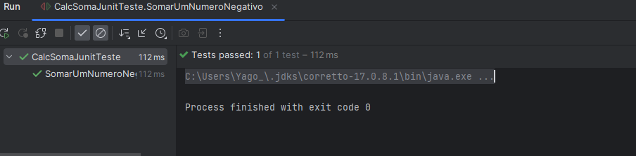
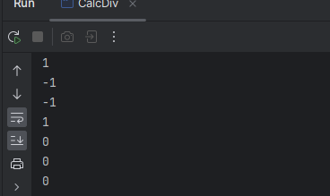
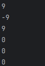
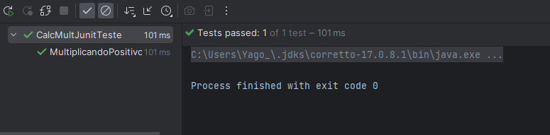

# Calculadora_Teste

## Descrição
  
 Este é um projeto de teste de uma calculadora utilizando Junit, realizando diversos testes com os operadores de +, -, / e * com uso de dois números inteiros

## Operações

  

      A soma é realizada com dois númerros inetiros sendo a e b os parâmetros, o número a esquerda(a) sempre será somado com o número a direita(b)
      ou seja a regra de sinais será dependente do valor de b sendo negativo ou positivo;
  

   

      A subtração também é relizada com dois números inteiros, a e b, onde o número a esquerda(a) será subtraido pelo número a direita(b) a regra de sinais será dita 
      pela variavel b; 
   

   

     A divisão é realiza por dois números inteiros, ou seja seus resultados não podem ser 'Quebrados'(número real), sendo apenas resultados inteiros, o cálculo é feito com
     dois parâmetros a e b, onde a será o dividendo e o b o divisor, ambas as variaveis podem influenciar a regras de siansi matematicos;
   

   

     A multiplicação é realizada com dois números inteiros onde número a é multiplicado por número b e retorna o resultado da multiplicação, ambos on números podem influenciar a regra de sinais matematicos.
   

## Testes
### Soma:
Teste 1:

 
    Este é um teste realizando a soma de dois números inteiros positivos, 
    3 e 7 com o resultado esperado sendo 10

Resultado:

 
    Este é a saída da execução do teste, afirmando positivo para o resultado 10 esperado 

Teste 2:

 
    Este é um teste realizando a soma de dois números inteiros,
    um sendo positivo 3 e um negativo -1 com o resultado esperado sendo 1

Resultado:

 
    Este é a saída da execução do teste, afirmando positivo para o resultado 1 esperado 

### Divisão:
Teste 1:

 
    Este é um teste realizando a divião de dois números inteiros positivos iguais, 
    o resultado esperado será 1

Resultado:

 
    Este é a saída da execução do teste, afirmando positivo para o resultado 1 esperado 

Teste 2:

 
    Este é um teste realizando a divisão de um número negativo(dividendo) -4 com 0 sendo o divisor,
    este teste visa testar se o o método é capaz de detectar o erro divisão por zero e trata-lo

Resultado:

 
    Este é a saída da execução do teste, o teste foi capaz de identificar uma Exception sendo lançada, 
    que tem o objetivo de evitar que o erro divisão por zero seja exibido ao usuario

### Multiplicação:
Teste 1:

 
    Este é um teste realizadn o a  multiplicação de dois número coum um sendo zero e o outro um número 
    negativo, sendo -4 o número usado e como resultado esperado 0

Resultado:

 
    Este é a saída da execução do teste, afirmando positivo para o resultado 0 esperado 

Teste 2:

    Este é um teste de multiplicação com dois números positivos, 
    sendo eles ambos 4 o resultado espereado dessa operação é 16

Resultado:

 
    Esta é a saida da execução do teste, dizendo que o teste teve um resultado positivo com 16 sendo devolvido

### Subtração:
Teste 1:

 
    Este é um teste de subtração com dois números positivos onde o Minuendo sendo omaior núemro da expessão, com 7 e 2
    o resultado esperado é 5

Resultado:

 
    Este é a saída da execução do teste, afirmando positivo para o resultado 5 esperado 

Teste 2:

 
    Este é um teste de subtração com dois números positivos, onde o Subtraendo é o maior número da expressão, 
    com 2 e 7 o resultado esperado é -5

Resultado:

 
    Este é a saída da execução do teste, afirmando positivo para o resultado -5 esperado

